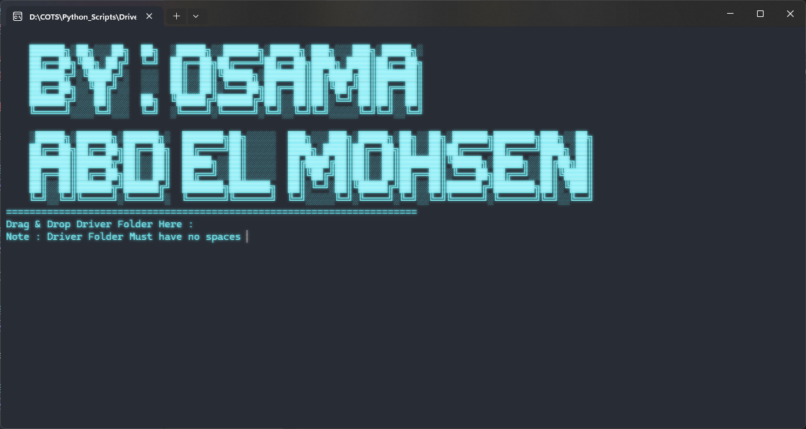
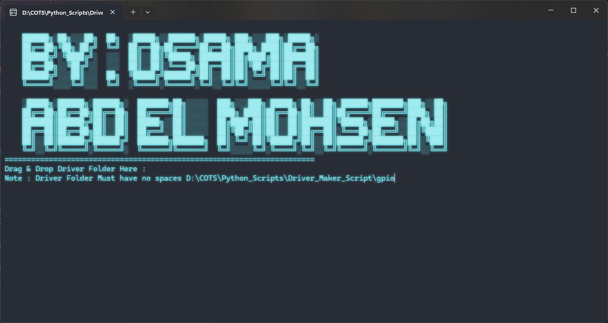
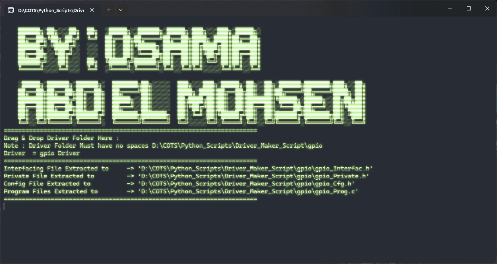
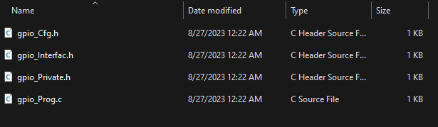
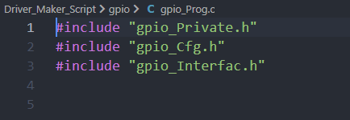
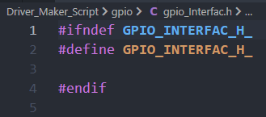

# Driver_Maker_Script With GUI 🤩
Driver_Maker_Script.py is a Python script to automate the extraction of Microcontroller Driver Files  . 
- Driver_Cfg.h      `With File Gaurd`
- Driver_Interfac.h `With File Gaurd`
- Driver_Private.h `With File Gaurd`
- Driver_Program.c `With .h Driver Files Include`
  

# 🛠️ Technologies Used:
- Python: Scripting and automation
- GCC: Compilation, preprocessing, and 
- CMD

# Downlaoding :
you can download the .exe file from the assets ⬇️
[Latest Release](https://github.com/Osama-Abd-El-Mohsen/ES_CodeGen_Scripts/releases/tag/v4.0)

# Usage 

1- Drag C File into the script

2- Hold off until the script is done executing.

# Result

|.C File| .h Files |
|--|--|
| ||

